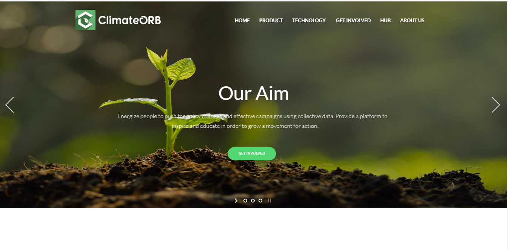

# ClimateOrb

                          

ClimateOrb provide Blockchain & IoT Based Data-Driven Methodologies for Climate Action, Indoor Environmental Quality (IEQ) Monitoring and APIs for Global Climate Data, so that both individuals and businesses can receive environmental data.

## Website Preview

## Webite Details

Climate change poses a fundamental threat to our planet's diversity. Hugely impacting the human and biological systems of the earth and threatening life as we know it. ClimateOrb utilizes data-driven methodologies to empower individuals and businesses with energy and CO2 reduction solutions, to aid in the fight against a warming earth. We do this by providing the tools that you need (third party API's and IoT Development Kits) to perform environmental sensing and track climate conditions.

Currently our Air Quality Monitoring Kit uses ESP32 as an IoT Device and environmental sensors such as PM2.5, PM10, Relative Humidity, Altitude, Temperature, Barometric Pressure and other hazardous pollutants to measure air pollutants within a 100sqm distance. In generating this data we hope to provide companies and individuals with specific awareness of the air quality around them. We can then provide climate action strategies and solutions.

## Contributing

Pull requests are welcome. For major changes, please open an issue first to discuss what you would like to change.
  
## Scripts included:

* CSS
* HTML
* Fontello
* jQuery

 
## Updates

### Update 1.0.0

* Website Created

### Update 1.0.1
* All pages added
* home,contact-us,about-us,products,our-recommendations,our-technologies   etc. pages added
* Readme Updated